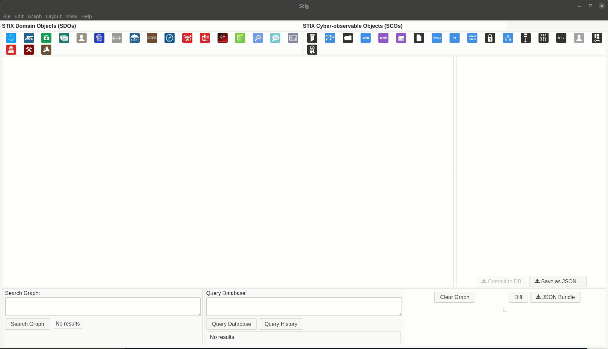

Using STIG 
===========
To run the STIG application, navigate to the installed directory (terminal) and run ``yarn start``. Alternatively, if you have built an executable you can click the hyperlinked icon to run STIG.

The ``yarn start`` command will run STIG in `developer mode` which is a live STIG build. Re-running ``yarn start`` will be required any time STIG closes.

Connecting to a Database
^^^^^^^^^^^^^^^^^^^^^^^^^

The recommended method for creating a database is to use STIG. The default configuration looks for a database being served off of localhost. If you have never used the application before, this database is not correctly configured.

.. note: Make sure Neo4j is running before attempting to connect STIG to the database.

Navigate to **Edit** / **Configure** / **Database Connection**.

.. raw:: html

    

.. role:: red

Select **New** to create a new database (:red:`* required`)

* **Host**: the IP address of the Neo4j server (localhost) :red:`*` 
* **Port**: the API port for Neo4j :red:`*` 
* **Database Name**: Enter a name for the database :red:`*` 
* **Database User**: Set a username for the database
* **Database User Password**: Set a password for the database
* **Database Admin**: This is the root user for the Neo4j install ("root") :red:`*` 
* **Database Admin Password**: This is the root password you setup for Neo4j :red:`*` 

Click **Save**.
On the next dialog you will be able to select the radio button for the database you wish to use, and click the "Use" button to enable that database configuration. This configuration will be remembered the next time you use the application. If done correctly, the application will create and load all necessary classes and allow you to use the application.

Adding Content to STIG 
^^^^^^^^^^^^^^^^^^^^^^

.. image:: importbundle.gif

Drag and Drop 
------------------
- Drag and drop a file containing a STIX bundle (https://oasis-open.github.io/cti-documentation/stix/walkthrough#-stix-bundle) from your file manager to the graph pane of STIG. If the bundle contains references to STIX objects whose definition is not included in the bundle, STIG will first search its database for an object matching the ID or the missing bundle.  If none are found, STIG will prompt if you wish to add one.  This object will need to have its details filled in by you.

- Drag or click on an icon in the topmost row of the UI.  This will add one instance of the selected object to the graph.  Click on the new item in the graph to edit its details.

Query Database
-----------------
Use the **Query Database** box to query the configured Neo4j database for objects. Queried objects will be added to the graph. Querying the database for an object that is already present in the graph may not have any visual effect, though it is possible for the layout to be rearranged. Queries should be written in the `Cypher Query Language <https://neo4j.com/docs/cypher-manual/current/introduction/>`_. For example:

``MATCH (n) RETURN n`` will return all objects in the database

``MATCH r=()-->() RETURN r`` will return all relationships and their corresponding objects

``MATCH (a:`attack-pattern`) WHERE a.name='MITRE ATT&CK' RETURN a LIMIT 1`` will return one attack-pattern with the name "MITRE ATT&CK"

Copy / Paste 
-----------------
- Cut the JSON of a STIX object out of a text editor.  Paste it into STIG using either Graph->Paste elements, or via CTRL/CMD-SHIFT-V.  Likewise you can copy the JSON of displayed elements by selecting them and using Graph->Copy Selected Elements or CTRL/CMD-SHIFT-C.

Creating Relationships 
----------------------
- Create relationships by hovering over an object in the graph, then dragging from the small red box to the other object.  When the target object's border turns purple release the mouse to complete the relationship.

Examining Data
^^^^^^^^^^^^^^^^^^

Search Graph
---------------
Objects and relationships in the displayed graph can be searched using this box. Presently this search supports searches of the format property:value. Property is any STIX property such as type, name, id, created, source_ref, etc. For example:

``type:attack-pattern`` will find and select all objects of type "attack-pattern".

``relationship_type:targets`` will find and select all relationships of the type "targets".

Diff 
----------
- Objects that are either differ or absent from the database will have their labels highlighted yellow.  The "Diff" button will display a diff of the displayed object's details vs the database version.  Items not present in the diff have no equivalent in the database.