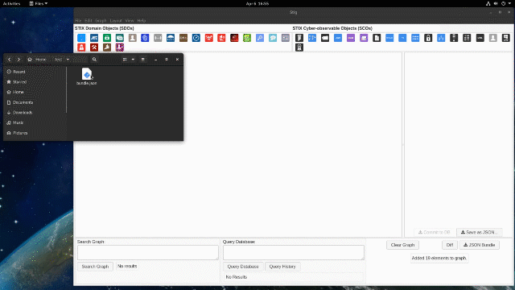

Using STIG 
===========
To run the STIG application, navigate to the installed directory (terminal) and run ``npm run dev`` or ``docker-compose up -d`` depending on the installation method chosen.

Connecting to a Database
^^^^^^^^^^^^^^^^^^^^^^^^^

.. note: Make sure Neo4j is running before attempting to connect STIG to the database.

Clicking the Advanced Tab (the rocket ship), navigate to **Advanced** / **Database** / **Profile**.

.. raw:: html

    

.. role:: red

Select **New** to create a new database (:red:`* required`)

* **Profile Name**:red:`*`: Friendly label for this database profile
* **Database Type**:red:`*`: Type of database. Only currently supported type is Neo4j
* **Host**:red:`*`: Connection url. Ex: neo4j://localhost:7687 
* **Database Name**:red:`*`: Database name to operate on. Default is 'neo4j'
* **Username**:red:`*`: Database username
* **Password**:red:`*`: Database password

Click **SAVE**.
Click **CONNECT**.

Adding Content to STIG 
^^^^^^^^^^^^^^^^^^^^^^

Drag and Drop 
------------------
- Drag and drop a file containing a `STIX bundle <https://oasis-open.github.io/cti-documentation/stix/walkthrough#-stix-bundle>`_ from your file manager to the graph pane of STIG.

- Drag or click on an icon in the topmost row of the UI.  This will add one instance of the selected object to the graph.  Click on the new item in the graph to edit its details.

Import
------------------
Click **Import** -> **JSON Bundle**. This will pop up the modal to import a JSON bundle file to the graph. This bundle must conform to the STIX specification defined `here <https://oasis-open.github.io/cti-documentation/stix/walkthrough#-stix-bundle>`_.

Query Database
-----------------
Use the **Query Database** box to query the configured Neo4j database for objects. Queried objects will be added to the graph. Querying the database for an object that is already present in the graph may not have any visual effect, though it is possible for the layout to be rearranged. Queries should be written in the `Cypher Query Language <https://neo4j.com/docs/cypher-manual/current/introduction/>`_. For example:

``MATCH (n) RETURN n`` will return all objects in the database

``MATCH r=()-->() RETURN r`` will return all relationships and their corresponding objects

``MATCH (a:`attack-pattern`) WHERE a.name='MITRE ATT&CK' RETURN a LIMIT 1`` will return one attack-pattern with the name "MITRE ATT&CK"

Creating Relationships 
----------------------
- Create relationships by hovering over an object in the graph, then dragging from the small red box to the other object.  When the target object's border turns purple release the mouse to complete the relationship.

Examining Data
^^^^^^^^^^^^^^^^^^

Find
---------------
Objects and relationships in the displayed graph can be searched by clicking **Edit** -> **Find**. Users can select one or more STIX properties and search for nodes or edges. This will highlight those nodes or edges on a match.

Diff 
----------
- Objects that are either differ or absent from the database will have their labels highlighted yellow.  The "Diff" button will display a diff of the displayed object's details vs the database version.  Items not present in the diff have no equivalent in the database.