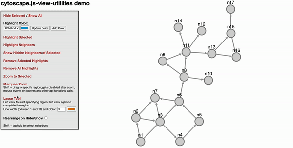

cytoscape-view-utilities
================================================================================

## Description

This Cytoscape.js extension provides miscellenaous view utilities such as hide/show, highlight, marquee zoom and free form selection, distributed under [The MIT License](https://opensource.org/licenses/MIT).



Please cite the following paper when using this extension: 

U. Dogrusoz , A. Karacelik, I. Safarli, H. Balci, L. Dervishi, and M. C. Siper, "[Efficient methods and readily customizable libraries for managing complexity of large networks](https://doi.org/10.1371/journal.pone.0197238)", PLoS ONE, 13(5): e0197238, 2018.

## Demo

Click [here](https://ivis-at-bilkent.github.io/cytoscape.js-view-utilities/demo.html) (no undo) or [here](https://ivis-at-bilkent.github.io/cytoscape.js-view-utilities/demo-undoable.html) (undoable) for a demo

## API

`var instance = cy.viewUtilities(options)` <br />
@param options — If not provided, default options will be used. See the below section for default options.
`highlightStyles` is array of objects. The objects should follow the format `{node: ..., edge: ...}`. `selectStyles` will be used if you want to override the highlighted styles when the objects are selected.
`lassoStyle` will be used to override the lasso line style.<br />
e.g
```js
var options = {
  highlightStyles: [
    { node: { 'border-color': '#0b9bcd',  'border-width': 3 }, edge: {'line-color': '#0b9bcd', 'source-arrow-color': '#0b9bcd', 'target-arrow-color': '#0b9bcd', 'width' : 3} },
    { node: { 'border-color': '#04f06a',  'border-width': 3 }, edge: {'line-color': '#04f06a', 'source-arrow-color': '#04f06a', 'target-arrow-color': '#04f06a', 'width' : 3} },
  ],
  selectStyles: { 
    node: {'border-color': 'black', 'border-width': 3, 'background-color': 'lightgrey'}, 
    edge: {'line-color': 'black', 'source-arrow-color': 'black', 'target-arrow-color': 'black', 'width' : 3} 
  },
  setVisibilityOnHide: false, // whether to set visibility on hide/show
  setDisplayOnHide: true, // whether to set display on hide/show
  zoomAnimationDuration: 1500, // default duration for zoom animation speed
  neighbor: function(ele){
      return ele.closedNeighborhood();
  },
  neighborSelectTime: 500,
  lassoStyle: {lineColor: "#d67614", lineWidth: 3} // default lasso line color, dark orange, and default line width
  htmlElem4marqueeZoom: '', // should be string like `#cy` or `.cy`. `#cy` means get element with the ID 'cy'. `.cy` means the element with class 'cy' 
  marqueeZoomCursor: 'se-resize', // the cursor that should be used when marquee zoom is enabled. It can also be an image if a URL to an image is given
  isShowEdgesBetweenVisibleNodes: true // When showing elements, show edges if both source and target nodes become visible
};
var api = cy.viewUtilities(options);
```

`instance.highlight(eles, idx = 0)` <br />
@param eles — [a cytoscape.js collection](https://js.cytoscape.org/#cy.collection) (collection of elements) to be highlighted <br />
@param idx — The index of the cytoscape.js style. If you don't specify it, the first style will be used. <br />
Apply style class to the specified elements. Style class is specified with its index <br />

`instance.highlightNeighbors(eles, idx = 0)` <br />
@param eles — [a cytoscape.js collection](https://js.cytoscape.org/#cy.collection) (collection of elements) to be highlighted <br />
@param idx — The index of the cytoscape.js style. If you don't specify it, the first style will be used. <br />
Highlights elements' neighborhood (based on the color option). Similar to the highlight function, either the elements and highlighting option can both be sent in the arguments. If only the elements are sent, then the default highlight color is used.

`instance.removeHighlights(eles)` <br />
@param eles — elements to remove highlights <br />
Remove highlights from eles.

`instance.hide(eles)` <br />
@param eles — elements to hide <br />
Hides given eles.

`instance.show(eles)` <br />
@param eles — elements to show <br />
Unhides given eles.

`instance.showHiddenNeighbors(eles)` <br />
@param eles — elements to show hidden neighbors <br />
Unhides hidden neigbors of given eles. Note that compound nodes are not respected as expected.

`instance.zoomToSelected(eles)` <br />
@param eles — elements to zoom <br />
Zoom to selected eles.

`instance.enableMarqueeZoom(callback)` <br />
@param callback — is called at the end of the function <br />
Enables marquee zoom. It is automatically called when CTRL+Shift keys are down.

`instance.disableMarqueeZoom()` <br />
Disables marquee zoom. It is automatically called when CTRL+Shift keys are up.

`instance.enableLassoMode(callback)` <br />
@param callback — is called at the end of the function<br />
Enables lasso tool.

`instance.disableLassoMode()` <br />
Disables lasso tool.

`instance.getHighlightStyles()` <br />
Returns current `highlightStyles` which is an array of objects like below
``` 
[
  { node: { 'border-color': '#0b9bcd',  'border-width': 3 }, edge: {'line-color': '#0b9bcd', 'source-arrow-color': '#0b9bcd', 'target-arrow-color': '#0b9bcd', 'width' : 3} },
  { node: { 'border-color': '#bf0603',  'border-width': 3 }, edge: {'line-color': '#bf0603', 'source-arrow-color': '#bf0603', 'target-arrow-color': '#bf0603', 'width' : 3} },
],
```

`instance.getAllHighlightClasses()` <br />
Returns all currently used [cytoscape.js style classes](https://js.cytoscape.org/#selectors/group-class-amp-id) 

`instance.changeHighlightStyle(idx, nodeStyle, edgeStyle) ` <br />
@param idx — index of the style that is going to be changed <br />
@param nodeStyle — [cytoscape style](https://js.cytoscape.org/#style) for nodes <br />
@param edgeStyle — [cytoscape style](https://js.cytoscape.org/#style) for edges <br />
Changes the style specified with `idx`.

`instance.addHighlightStyle(nodeStyle, edgeStyle) ` <br />
@param nodeStyle — [cytoscape style](https://js.cytoscape.org/#style) for nodes <br />
@param edgeStyle — [cytoscape style](https://js.cytoscape.org/#style) for edges <br />
Adds a new style to the `highlightStyles` array.

`instance.removeHighlightStyle(styleIdx): void` <br />
@param styleIdx —  index of the style to delete (0 based) <br />
Removes the style from `highlightStyles` array.

`instance.changeLassoStyle(styleObj) ` <br />
@param styleObj — lasso line style object with lineColor and/or lineWidth properties

## Default Options
```js
var options = {
  highlightStyles: [],
  selectStyles: {},
  setVisibilityOnHide: false, // whether to set visibility on hide/show
  setDisplayOnHide: true, // whether to set display on hide/show
  zoomAnimationDuration: 1500, // default duration for zoom animation speed
  neighbor: function (ele) { // return desired neighbors of tapheld element
    return false;
  },
  neighborSelectTime: 500, // ms, time to taphold to select desired neighbors in addition to the taphold event detect time by cytoscape
  lassoStyle: {lineColor: "#d67614", lineWidth: 3} // default lasso line color, dark orange, and default line width
};
```

## Default Undo-Redo Actions

`ur.do("highlight", args)` 

`ur.do("highlightNeighbors", args)` 
`ur.do("highlightNeighbours", args)` 

`ur.do("removeHighlights")` 

`ur.do("hide", eles)` 

`ur.do("show", eles)` 

## Dependencies

 * Cytoscape.js ^3.2.0
 * Geometric.js ^2.2.3
 * cytoscape-undo-redo.js ^1.0.8 (optional)

## Usage instructions

Download the library:
 * via npm: `npm install cytoscape-view-utilities` , 
 * via bower: `bower install cytoscape-view-utilities` , or
 * via direct download in the repository (probably from a tag).

`require()` the library as appropriate for your project:

CommonJS:

``` js
var cytoscape = require('cytoscape');
var viewUtilities = require('cytoscape-view-utilities');

viewUtilities(cytoscape); // register extension
```

AMD:

``` js
require(['cytoscape', 'cytoscape-view-utilities'], function(cytoscape, view - utilities) {
    view - utilities(cytoscape); // register extension
});
```

Plain HTML/JS has the extension registered for you automatically, because no `require()` is needed.

## Build targets

* `npm run build` : Build `./src/**` into `cytoscape-view-utilities.js` in production environment and minimize the file.
* `npm run build:dev` :  Build `./src/**` into `cytoscape-view-utilities.js` in development environment without minimizing the file.

## Publishing instructions

This project is set up to automatically be published to npm and bower.  To publish:

1. Build the extension : `npm run build`
1. Commit the build : `git commit -am "Build for release"`
1. Bump the version number and tag: `npm version major|minor|patch`
1. Push to origin: `git push && git push --tags`
1. Publish to npm: `npm publish .`
1. If publishing to bower for the first time, you'll need to run `bower register cytoscape-view-utilities https://github.com/iVis-at-Bilkent/view-utilities.git`

## Team

  + [Hasan Balci](https://github.com/hasanbalci), [Metin Can Siper](https://github.com/metincansiper), [Huseyin Eren Calik](https://github.com/herencalik), [Mubashira Zaman](https://github.com/MobiZaman), and [Ugur Dogrusoz](https://github.com/ugurdogrusoz) of [i-Vis at Bilkent University](http://www.cs.bilkent.edu.tr/~ivis)

## Alumni

  + [Selim Firat Yilmaz](https://github.com/mrsfy), [Leonard Dervishi](https://github.com/leonarddrv), [Kaan Sancak](https://github.com/kaansancak)

